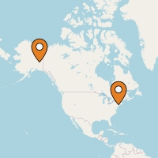

## Static Map Images as a Service
  

Generate static map images/thumbnails as a web service. It can be used as a microservice in your project.

 

## Motivation

Building out of the box product for generating static map images as a web service as an alternative to the Google Static Map API.

## Build status

## Code style
This project follows `Airbnb` javascript style guide.

 
## Screenshots

Images can be generated as follows using URL parameters

`<your baseurl>?markers=40.714728,-73.998672|63.259591,-144.667969&size=200x200`  

## Tech/framework used
- [Nodejs](https://nodejs.org)
- [Fastify](https://www.npmjs.com/package/fastify)
- [StaticMaps](https://www.npmjs.com/package/staticmaps)
- [Jest](https://jestjs.io/)

## Features

Following can be draw on a map using this API service thanks to [StaticMaps](https://www.npmjs.com/package/staticmaps).
- Markers
- Paths
- Polygons
- Texts

## Installation

You can install this API as a docker image or as a bare Node.js web service

1. Node.js API service
    1. Clone this project
    2. Install `npm` dependencies using `npm install` or `npm ci`
    3. Create configuration file by renaming `.env.sample` to `.env`
    4. Configure variables in `.env` file
    5. Start the web server using `npm start`
2. Docker image @TODO
    1. Pull the docker image from [Docker Hub](https://hub.docker.com)
    2. Update your environment variables.
    3. Run the docker container
3. As a serverless solution
    @TODO

## Tests

Tests can be found in `/test` directory. Tests can be run using `npm test`.

## How to use?
Please refer the [Wiki](https://github.com/gihan10/staticmap-service/wiki) page for detailed use of the API.

## Contribute

  

Contributions are welcome to the project. Please kindly go through the [contributing guidelines](.github/CONTRIBUTING.md)

## Credits

Awesome [StaticMaps](https://www.npmjs.com/package/staticmaps) npm module by [Stephan Georg](https://github.com/StephanGeorg)   
Map images and data provide by [Openstreetmap.org](https://www.openstreetmap.org/copyright)  
[Pittsburgh Map icon](https://icons8.com/icons/set/pittsburgh-map) by [Icons8](https://icons8.com)

## License
This work is licensed under the terms of the MIT license.  
For a copy, see <https://opensource.org/licenses/MIT>.

The map samples are from © OpenStreetMap contributors

